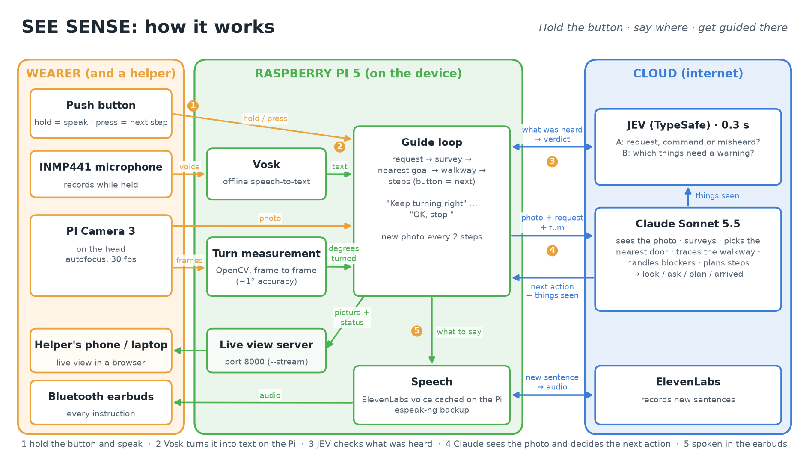

# SEE SENSE: pitch deck content

**Format:** title, problem, who it's for, solution, demo, how it works, design principles, what
it's built from, results and limits, what's next, ask. 11 slides, about 5 minutes.
Each slide has: the **headline** (one message), **on the slide** (keep it short),
**speaker notes** (what you say) and a **visual** suggestion.

Every number comes from our own tests. Placeholders are in [brackets].

---

## 1. Title

**Headline:** SEE SENSE

**On the slide**
- Hold the button. Say where you want to go. Get guided there.
- A wearable indoor guide for blind people
- [Team name] · Jugaad Junction hackathon (Tinkerhub × Superhuman Lab)

**Speaker notes:** "We built a wearable that guides a blind person to a place they can't see
(a door, the exit, a seat) one step at a time."

**Visual:** a person wearing it: the camera on the head; one clean product photo.

---

## 2. The problem

**Headline:** Every new room is a puzzle

**On the slide**
- A cane finds what's at your feet, not where the door is
- GPS doesn't work indoors
- Description apps say "there's a door", not how to reach it
- A phone needs a free hand, and the cane already has one

**Speaker notes:** "Imagine walking into a classroom you've never seen and needing the way out.
A white cane tells you about the chair leg in front of you. It can't tell you the door is
behind you on the right, past three tables. Today, the answer is: ask someone."

**Visual:** a top-down sketch of a room: a person, tables, chairs, a door, and a question mark.

---

## 3. Who it's for

**Headline:** Blind and low-vision people who get around on their own

**On the slide**
- They already move independently with a white cane
- Indoors, in places they don't know: colleges, offices, hospitals, stations, shops
- They need help at one moment: "where is it, and how do I get there?"

**Speaker notes:** "Our users don't need a device that talks all the time: their hearing tells them
about the room. They need help at the moment of 'where is it?'"

**Visual:** three icons: college, hospital, office.

---

## 4. The solution

**Headline:** A guide that looks, plans and walks you there

**On the slide**
1. **Hold** the button: "Take me to the exit"
2. **It looks around:** "Turn right about 90 degrees." … "OK, stop." (it measures your turn from the camera)
3. **It plans the walkway:** "Walk about 3 steps. The tables will be on your left."
4. **It warns only when it matters:** "A person on your left, coming toward you."
5. **It clears the way:** "The chair is right in front of you. Push it to your left."
6. **You arrive:** "The door is right in front of you. The handle is on the right."

**Speaker notes:** "SEE SENSE works like a sighted friend: it looks around first, finds the
nearest door, works out how far the way is clear, and if a chair is blocking it, tells you how to
move it. Press the button for the next step. Every two steps, it looks again. Along the way it
doesn't talk about everything it sees: only what you need, like someone walking toward you."

**Visual:** six numbered frames from the demo video.

---

## 5. Demo

**Headline:** Watch it find the door

**On the slide:** the 90-second explainer video, or a live demo with the **live view** on the
projector: the audience sees what the camera sees and the sentence it speaks.

**Speaker notes:** "In our test, SEE SENSE started facing a cupboard. It said there was no exit
in view and asked the user to turn right. It found a glass door about 5 steps away, warned that
it's glass, and routed around the tables. 8 seconds, plus the time to turn. On the Raspberry
Pi, in a real classroom, it found an open glass door to a balcony, with chairs in front of it."

**Visual:** the video, full screen, or the live view (`python main.py --stream`, then open
`http://<PI_IP>:8000`). Keep a backup recording in case the live demo fails.

---

## 6. How it works

**Headline:** Claude sees. JEV decides fast. You hear only what matters.

**On the slide**

| Part | Job |
|---|---|
| Head-mounted camera | Claude's eyes; also measures how far you've turned your head (to about 1°) |
| Claude Sonnet 5.5 (Anthropic) | Understands the room, picks the nearest door, plans the route, deals with blockers |
| JEV (TypeSafe) | In 0.3 s: was that a request, a command, or misheard words? Which things Claude saw need a spoken warning, or nothing? |
| Button + offline speech recognition (Vosk) | Hold to speak, press for the next step |
| Earbuds | Every instruction, in a natural voice (ElevenLabs) recorded once and stored on the device |
| Live view | A helper, trainer or judge sees what SEE SENSE sees, in any browser |

**Speaker notes:** "Two AIs, each doing what it's best at. Claude does the hard thinking:
understanding the room and planning. JEV makes quick decisions in a third of a second: if the
microphone misheard you, it says so at once instead of spending a slow Claude look; and it decides
which things are worth a warning, so the device stays quiet. The device itself is a Raspberry Pi
with no AI models on it."

**Visual:** the architecture diagram, [`docs/architecture.png`](architecture.png) (PNG for the slide;
`architecture.svg` scales to any size). Regenerate it with `python docs/make_architecture.py`.

---

## 7. Design principles

**Headline:** Built around how blind people actually move

**On the slide**
- **Quiet by default:** only instructions and real warnings are spoken; JEV leaves minor things out
- **Survey before planning:** it looks around and finds the *nearest* door, and checks from another
  angle before deciding the way is blocked
- **Hands free:** one button, no phone in hand
- **Honest:** says when it's unsure; never says a path is "safe"
- **Respectful:** never asks you to move a person or someone's wheelchair

**Speaker notes:** "Blind people use their hearing to understand a room: footsteps, voices,
echoes. So SEE SENSE only speaks when it has something you need."

**Visual:** a person with earbuds, and a speech bubble that appears only at key moments.

---

## 8. What it's built from

**Headline:** Simple hardware; the intelligence is in the cloud

**On the slide**

| Hardware | Software |
|---|---|
| Raspberry Pi 5 + Active Cooler | Claude Sonnet 5.5: seeing and planning |
| Pi Camera 3, head-mounted | JEV (TypeSafe): quick decisions on short text |
| INMP441 microphone | Vosk: offline speech recognition |
| Push button | ElevenLabs voice, cached on the device; espeak-ng as backup |
| Bluetooth earbuds | OpenCV: measures turns from the camera |
| Power bank | Python, picamera2, gpiozero, systemd |

- Device software: **73 MB**, no AI models on the device
- Each Claude look: **~2,900–4,300 tokens in, ~140–190 out** (measured); about $0.01–0.02 a look
  (estimate)

**Speaker notes:** "The wearable is a Raspberry Pi with a camera, a microphone and one button.
It sends a photo to Claude when it needs to look, and keeps everything else on the device."

**Visual:** a photo of the Pi build with each part labelled.

---

## 9. Results and limits

**Headline:** Built, tested, and running on the hardware

**On the slide**
- Live tests: found a glass door past tables; first answer in **4.5 s**, re-checks in **3.1 s**
- Survey with one turn: **8 s** plus turning time
- JEV decisions: **0.3 s**; catches misheard speech and commands said another way
  ("what do I do now" = next step, "cancel that" = stop)
- **On the Raspberry Pi 5**, in a real classroom: understood "go to the bathroom" and found an
  open glass door; fixes from that first run are shipped
- 27 automated tests
- **Limits:** needs internet; indoor wayfinding only, not traffic; distances are estimates;
  use it with the cane, not instead of it
- **Not yet tested with blind users**

**Speaker notes:** "We're honest about what's proven. The software works, it runs on the
hardware, and we've measured the timing. On the Pi's first run, answers took 6 to 29 seconds, so
we made the pictures smaller and added a 'Still looking' message. What we haven't done yet is the
most important part: testing with blind users."

**Visual:** a short checklist with ticks, and one open box: "tested with blind users".

---

## 10. What's next

**Headline:** Next: feel the way, and a safety net that works offline

**On the slide**

| Next step | What it adds | Where it stands |
|---|---|---|
| **Haptic feedback:** 4 vibration motors (left, front-left, front-right, right) | Direction by touch instead of words: a pulse on the left or right until you face the right way; a long buzz on the front when something is close; a short pulse on the side of something minor; three pulses when you arrive | Software written and tested (simulated); motors to be fitted, driven through transistors |
| **ToF distance sensor** (VL53L0X / VL53L1X), next to the camera | An obstacle warning with **no internet and no AI**: buzz under 1 m, "Stop" under 0.5 m. It also tells SEE SENSE the exact moment you reach a chair to move | Software written and tested (simulated readings); the chip is detected automatically |
| **Testing with blind users** | Tune the wording, timing and vibration patterns with the people who'll use it | Our first priority |

**Speaker notes:** "Two hardware pieces are next, and their software is already written and
tested. Vibration motors, so direction is felt instead of spoken and the ears stay free for the
room. And a distance sensor, so there's a safety net that works even without the internet:
it buzzes when something is close and says 'Stop' when it's very close. Most important of all:
testing with blind users."

**Visual:** a body outline with the 4 motor positions, and the sensor next to the camera with
its 1 m and 0.5 m zones.

---

## 11. Team and ask

**Headline:** Help us test it

**On the slide**
- Team: [name, role] · [name, role] · [name, role]
- We're looking for:
  - **Blind and low-vision testers** and organisations to test with
  - **Mentors** in assistive technology
- [Contact] · [Link to the video]

**Speaker notes:** "We don't give you eyes. We give you another way to find your way. We're
looking for people to test it with. Thank you."

**Visual:** team photos; a QR code to the video or contact.

---

## Appendix slides (for questions)

- **Privacy:** pictures go to Claude only during a request; nothing is stored on the device.
  JEV only gets short text (what was said, a list of things seen), never pictures. The live view
  is off unless started, and only reachable on the local network
- **If the cloud fails:** without JEV, speech goes straight to Claude; without Claude, SEE SENSE
  says it can't plan right now
- **Safety:** SEE SENSE never says a path is safe; it works with the cane, not instead of it
- **Speech:** recognised offline on the device; if it's misheard, SEE SENSE asks you to say it again
- **Wiring and setup:** see the README
